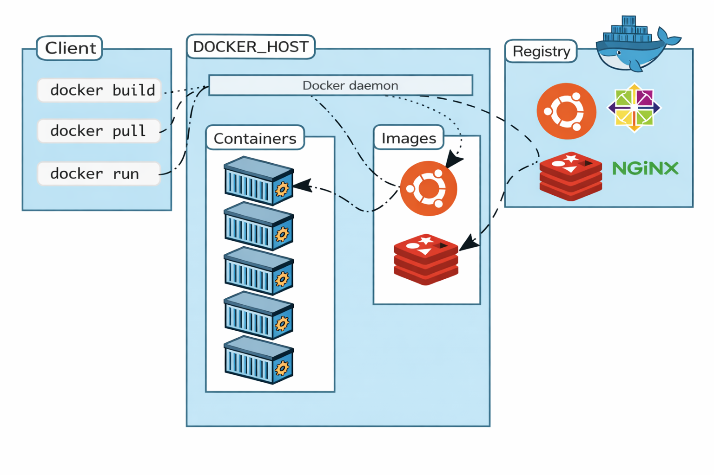
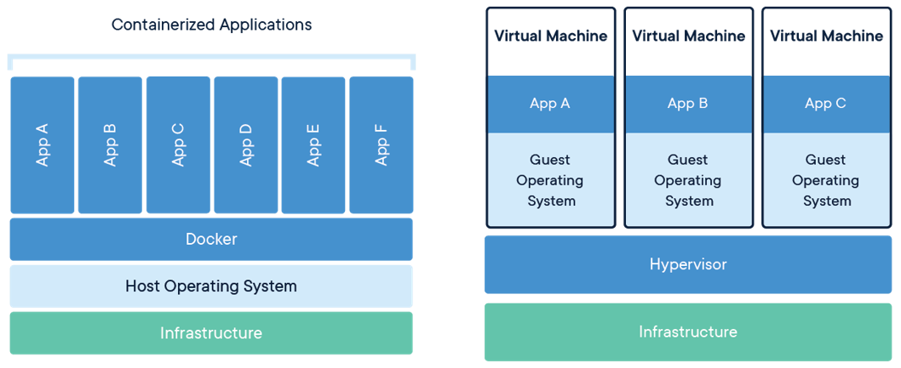

# Docker

## ¿Que es Docker?

+ Docker es una plataforma que permite crear, ejecutar, actualizar y administrar contenedores.

+ Un contenedor es un empaquetado que contiene el código y las dependencias de una aplicación en un formato estándar que permite su ejecución rápida y fiable en entornos de computo.

+ El mismo contenedor siempre produce exactamente la misma aplicación y comportamiento de ejecución, sin importar dónde o quién la ejecute.

## ¿Para que usamos docker?

+ Docker es usado con diferentes propósitos, por ejemplo:
  + Llevar código de aplicaciones web a ambientes de pruebas o productivos
  + Desplegar trabajos en batch dentro de contenedores
  + Empaquetar código con modelos de machine learning para enviar a entrenar
  + Desplegar bases de datos de pruebas como postgres, redis, etc
  + Contenedores acelerados con GPU para cargas de trabajo en computación grafica

## Arquitectura de Docker

La arquitectura de Docker se basa en un modelo cliente-servidor ligero que utiliza contenedores para empaquetar y ejecutar aplicaciones. Sus componentes principales son el Docker Host (donde corre el daemon), el Docker Client (CLI) y el Registry (repositorios como Docker Hub). 

+ **Docker Client :** Es la interfaz de línea de comandos (CLI) utilizada para interactuar con el motor de Docker (Docker Engine). Actúa como el intermediario entre el usuario y el demonio de Docker, enviando comandos a través de la API REST para gestionar contenedores e imágenes.

+ **Docker Daemon (dockerd) :** Es el proceso de servicio en segundo plano que actúa como el motor central de Docker, corriendo en el sistema operativo host. Se encarga de gestionar el ciclo de vida completo de los contenedores (creación, ejecución, monitorización), imágenes, redes y volúmenes, escuchando solicitudes API de la CLI.

+ **Docker Registry :** Es un sistema de almacenamiento y distribución centralizado para imágenes de Docker. Actúa como una biblioteca o repositorio donde se suben (push) y descargan (pull) las imágenes necesarias para ejecutar contenedores, facilitando el intercambio de software, el control de versiones y la implementación en entornos de desarrollo o producción

<p align="center">

</p>

## Maquinas virtuales VS Contenedores

Las **máquinas virtuales (VM)** y los **contenedores** permiten ejecutar aplicaciones de forma aislada, pero funcionan de manera diferente. Una máquina virtual emula un computador completo. Un contenedor ejecuta aplicaciones aisladas, pero comparte el kernel del sistema operativo host.

| Contenedor | Maquina Virtual | 
|---|---|
| Bajo impacto en el sistema operativo, rápido, menor uso de espacio en disco. | Alto impacto en el sistema operativo, lento, mayor uso de espacio en disco. |
|Compartir, reconstruir y distribuir es sencillo. | Compartir, reconstruir y distribuir puede ser todo un reto. |
|Encapsula aplicaciones y ambientes en lugar de la maquina entera. | Encapsula la maquina entera en lugar de solo aplicaciones y ambientes. |

<p align="center">

</p>

## Información de Docker

Se pueden utilizar los siguientes subcomandos para obtener más información sobre la instalación y el uso de Docker:

#### Docker info 

Imprime información sobre el sistema Docker y el host.

```sh
$ docker info
```

#### Docker help

Imprime información de uso y ayuda para el subcomando dado.

```sh
$ docker help
```
#### Docker version

Imprime información de la versión de Docker para el cliente y el servidor, así como la versión de Go utilizada en la compilación.

```sh
$ docker version
```

## Comandos útiles en linux

#### ls

Te permite listar el contenido del directorio que desea (el directorio actual de forma predeterminada), incluidos archivos y otros directorios anidados.

```sh
$ ls
```

#### pwd

El comando pwd significa "Print Working Directory" y genera la ruta absoluta del directorio en el que se encuentra.

```sh
$ pwd
```
#### cd

El comando cd se refiere a "Change Directory", como su nombre indica, lo lleva al directorio al que está intentando acceder.

```sh
$ cd path/to/go
```

ejemplo:

```sh
$ cd /home/Max/Documents/
```

Para ir al directorio home

```sh
$ cd 
```

Para ir un nivel atras

```sh
$ cd ..
```

#### touch

El comando touch te permite crear un archivo

```sh
$ touch new_file.txt
```

#### mkdir

El comando mkdir se refiere a "Make Directory", como su nombre indica, crea un nuevo directorio.

```sh
$ mkdir directory_name
```

Para crear directorios de manera recursiva, usaremos el comando de la siguiente manera:

```sh
$ mkdir -p directory_name/sub_folder/sub_sub_folder
```

#### cp

El comando cp te permite copiar archivos y carpetas desde la terminal

Para copiar un archivo debes utilizar el comando cp de la siguiente forma

```sh
$ cp file_to_copy.txt new_file.txt
```

Para copiar una carpeta debes utilizar el comando cp de la siguiente forma

```sh
$ cp -r dir_to_copy/ new_copy_dir/
```

#### rm

El comando rm te permitira eliminar archivos y carpetas desde el terminal

Para eliminar un archivo debes utilizar el comando rm de la siguiente forma

```sh
$ rm file_to_copy.txt
```

Para eliminar una carpeta debes utilizar el comando rm de la siguiente forma

```sh
rm -r dir_to_remove/
```

#### echo

El comando echo muestra texto definido en la terminal

```sh
echo "Hola Mundo"
```

Se utiliza usualmente para imprimir ambientales de entorno dentro de estos mensajes:

```sh
echo "Hey $USER"
```

#### cat

Cat de la palabra "Concatenate", te permite crear, ver y concatenar archivos directamente desde la terminal. Se utiliza principalmente para obtener una vista previa de un archivo sin abrir un editor de texto gráfico:

```sh
cat long_text_file.txt
```

#### ping

Ping es la utilidad de terminal de red más popular que se utiliza para probar la conectividad de la red.

```sh
ping google.com
```

#### curl

Curl es la abreviatura de Client URL. Los comandos de cURL están diseñados para funcionar como una forma de verificar la conectividad a las URL y como una herramienta para transferir datos.

```sh
curl http-web-page
```

Rápidamente puedes obtener tu ip pública con el siguiente comando

```sh
curl http://checkip.amazonaws.com
```
