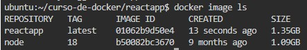
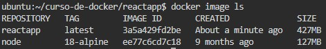
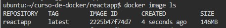

# Optimizando imagenes Docker

La optimización es importante; la reducción del tamaño de nuestra imagen Docker nos va a permitir ahorrar costos. 

En el siguiente ejemplo vamos a dockerizar una aplicación con React y vamos a reducir su tamaño.

## Dockerizamos nuestra aplicacion

Primero nos colocamos en la carpeta reactapp, luego creamos el archivo Dockerfile

```sh
FROM node:18

WORKDIR /app
COPY app /app
RUN npm install -g webserver.local
RUN npm install && npm run build

EXPOSE 3000
CMD webserver.local -d ./build
```

Construimos la imagen con el comando

```
docker build -t reactapp .
```

Para ver el tamaño de la imagen usamos el comando ```docker image ls```

<p align="center">

</p>

Observamos que la imagen pesa 1.35 GB

## Primera optimización: use una imagen de base clara

Normalmente, las imágenes basadas en Alpine o BusyBox son de tamaño extremadamente pequeño en comparación con las basadas en otras distribuciones de Linux, como Ubuntu . Esto se debe a que Alpine y esas otras imágenes se han optimizado para incluir los paquetes mínimos y obligatorios.

Modificamos el Dockerfile y usamos Alpine como base

```sh
FROM node:18-alpine

WORKDIR /app
COPY app /app
RUN npm install -g webserver.local
RUN npm install && npm run build

EXPOSE 3000
CMD webserver.local -d ./build
```

Construimos la imagen con el comando

```
docker build -t reactapp .
```

Para ver el tamaño de la imagen usamos el comando ```docker image ls```

<p align="center">

</p>

Observamos que la imagen pesa 427 MB

## Segunda optimización: construcción de varias etapas

Con la compilación de múltiples etapas, podemos usar múltiples imágenes base en el Dockerfile y copiar artefactos, archivos de configuración, etc. de una etapa a otra, para que podamos descartar lo que no necesitamos.

En este ejemplo, lo que necesitamos para implementar la aplicación React es el código compilado; no necesitamos los archivos fuente, ni el directorio node_modules , ni el package.json , etc.

Modificamos el Dockerfile y usamos la construccion en varias etapas

```sh
FROM node:18-alpine AS build
WORKDIR /app
COPY app /app
RUN npm install && npm run build


FROM node:18-alpine
WORKDIR /app
RUN npm install -g webserver.local
COPY --from=build /app/build ./build
EXPOSE 3000
CMD webserver.local -d ./build
```

Construimos la imagen con el comando

```
docker build -t reactapp .
```

Para ver el tamaño de la imagen usamos el comando ```docker image ls```

<p align="center">

</p>

Observamos que la imagen pesa 146 MB

