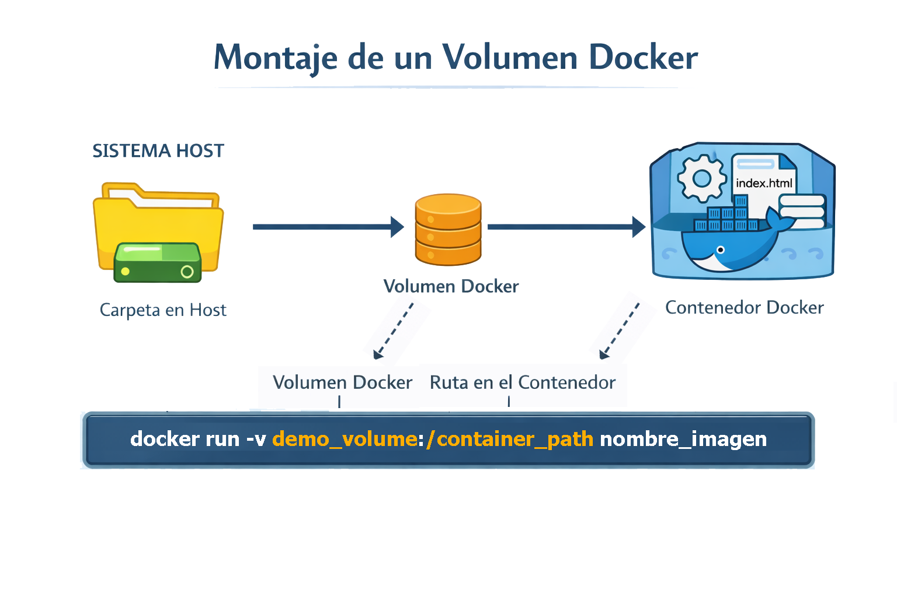
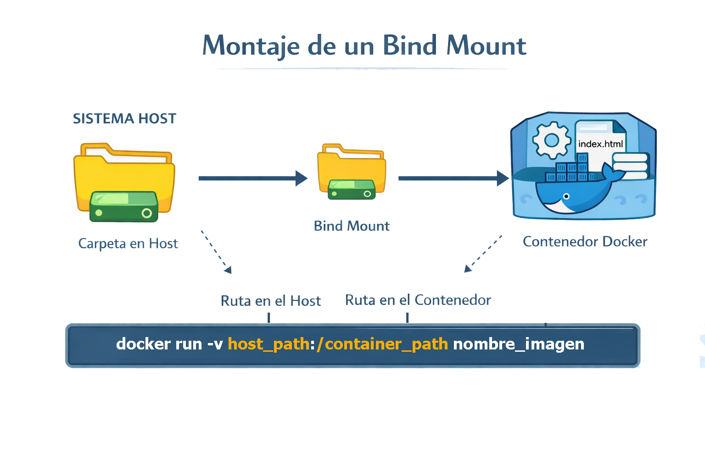

# Almacenamiento

De manera predeterminada, todos los archivos creados dentro de un contenedor se almacenan en una capa de contenedor que permite la escritura, los datos escritos en la capa de contenedor no persisten cuando se destruye el contenedor.

La capa que permite la escritura es única por contenedor. No se pueden extraer fácilmente los datos de la capa que permite la escritura al host o a otro contenedor.

Docker admite los siguientes tipos de montajes de almacenamiento para almacenar datos fuera de la capa de escritura del contenedor:

+ Volúmenes ( gestionados por Docker)
+ Montajes de enlace
+ Montajes tmpfs 

## Volúmenes ( gestionados por Docker ) 

Los volúmenes son mecanismos de almacenamiento persistentes administrados por el demonio de Docker. 

Conservan los datos incluso después de que se eliminen los contenedores que los utilizan. 

Los datos del volumen se almacenan en el sistema de archivos del host, pero para interactuar con los datos del volumen, debe montar el volumen en un contenedor.

Los volúmenes son ideales para el procesamiento de datos críticos para las necesidades de almacenamiento a largo plazo.

Se pueden crear dos tipos de volúmenes: Nombrados y anonimos

<p align="center">

</p>

#### docker volume create

Crea un nuevo volumen en el que los contenedores pueden consumir y almacenar datos. Si no se especifica un nombre, Docker genera un nombre aleatorio.

```sh
$ docker volume create [VOLUME]
```

#### docker volume ls

Lista los volúmenes

```sh
$ docker volume ls
```

#### docker volume rm

Elimina uno o mas volúmenes

```sh
$ docker volume rm [VOLUME...]
```
#### docker volume inspect

Devuelve información sobre un volumen.

```sh
$ docker volume inspect
```

#### Montamos un volumen nombrado en el contenedor
Podemos montar un volumen mientras arrancamos un containers, si el volumen no se creo previamente este se crea, el formato usado sera "-v VOLUME_NAME:CONTAINER_PATH"

```sh
docker run -v demo_volume:/app -p 8080:80 -d nginx
```

Podemos montar el mismo volumen en varios contenedores al mismo tiempo

### Volumenes anonimos

Docker lo crea automáticamente cuando se inicia un contenedor con un punto de montaje pero sin un nombre de volumen específico.

```sh
docker run -v /app -p 8080:80 -d nginx
```

## Montajes de enlace

Los montajes de enlace crean un vínculo directo entre una ruta del sistema host y un contenedor, lo que permite el acceso a archivos o directorios almacenados en cualquier parte del host. 

Utilice montajes de enlace cuando necesite poder acceder a archivos tanto desde el contenedor como desde el host.

<p align="center">

</p>

#### Montamos una carpeta del host en el contenedor

También podemos enlazar una carpeta en el host con el contenedor, el formato usado sera "-v HOST_PATH:CONTAINER_PATH"

```sh
docker run -v /home/ec2-user/environment/max:/app -p 8080:80 -d nginx
```
## Montajes tmpfs  (Temporary file system)

Si está ejecutando Docker en Linux, puede usar los montajes tmpfs.

A diferencia de los volúmenes y los montajes de enlace, un montaje tmpfs es temporal y solo persiste en la memoria del host. Cuando el contenedor se detiene, el montaje tmpfs se elimina y los archivos escritos allí no se conservarán.

Los montajes tmpfs se utilizan mejor en los casos en los que no desea que los datos persistan ni en la máquina host ni dentro del contenedor. Esto puede deberse a razones de seguridad o para proteger el rendimiento del contenedor cuando su aplicación necesita escribir un gran volumen de datos de estado no persistentes.

#### Montamos una carpeta en la memoria del host

También podemos montar una carpeta del contenedor en la memoria del host

```sh
docker run --tmpfs /app -p 8080:80 -d nginx
```

# Eliminando todos los recursos creados

Si deseas eliminar rapidamente todos los recursos creados (containers, networks, images), utilizaras el siguiente comando

```sh
docker system prune -a
```

Si tambien quieres eliminar los volumenes, debes lanzar el siguiente comando

```sh
docker system prune -a --volumes
```

# Copiando data

Para poder copiar data entre el host y los contenedores  usaremos el comando copy 

#### docker cp

El comando cp te permitira copiar archivos, para ello usaremos el siguiente comando

```sh
docker cp CONTAINER:SRC_PATH DEST_PATH
docker cp SRC_PATH  CONTAINER:DEST_PATH
```
